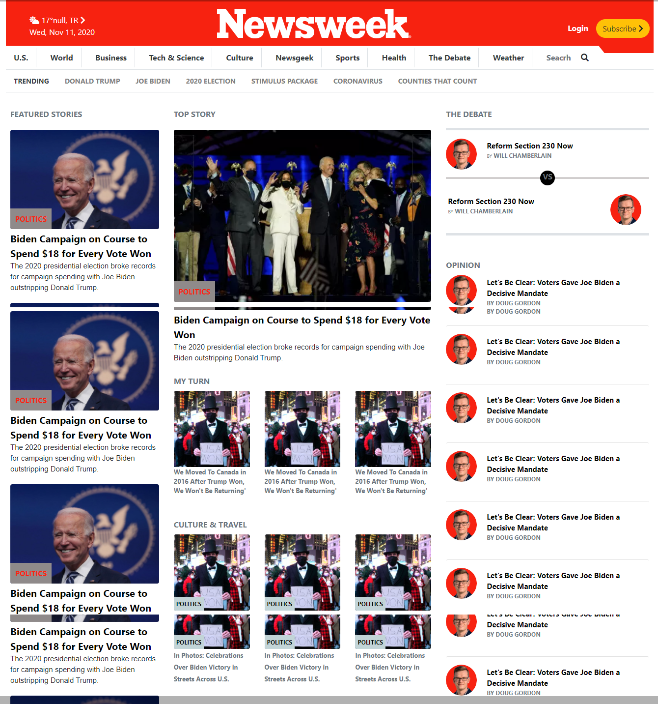

# Newsweek-cloning-Bootstrap

This is cloning Newsweek home page by using Bootstrap

# Project Name

> Cloning Newsweek home page.

We cloned this [Newsweek](https://www.newsweek.com/) page, with applying these instructions:

- Bootstrap.
- Responsive with two breakpoints.

## Built With

- HTML.
- CSS.
- Bootstrap
- FONTAWESOME.
- Javascript.

## Live Demo

Here you will find a Live Demo page, any comment is well recieved.

[Live Demo Link](https://ahmedamin90.github.io/Newsweek-cloning-Bootstrap/)

## Authors

Please feel free to contact us in any time:

👤 **Elberth Corniell **

- GitHub: [@elberthcorniell](https://github.com/elberthcorniell)
- Twitter: [@elberthcorniell](https://twitter.com/elberthcorniell)
- LinkedIn: [LinkedIn](https://www.linkedin.com/in/elbert-corniell-989183159/)

👤 **Ahmed AMin**

- GitHub: [@githubhandle](https://github.com/AhmedAmin90)
- Twitter: [@twitterhandle](https://twitter.com/AhmedAmin12383)
- LinkedIn: [LinkedIn](https://www.linkedin.com/in/ahmed-amin-quality/)

## 🤝 Contributing

Contributions, issues, and feature requests are welcome!

Feel free to check the [issues page](https://github.com/AhmedAmin90/Newsweek-cloning-Bootstrap/issues).

## Show your support

Give a ⭐️ if you like this project!
Also advices are well recieved.

## Acknowledgments

- Microverse Team.

## 📝 License

This project is [MIT](./LICENSE.md) licensed.
